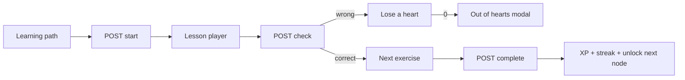

# Duolingo Web Clone

A fullstack clone of the Duolingo web learning app for an SDE placement assignment. It recreates the winding learning path, the lesson player (five exercise types), hearts, XP, streaks, and a seeded Spanish course.

**Live demo:** _add Vercel URL after deploy_  
**API:** https://duolingo-7ndg.onrender.com  
**GitHub:** https://github.com/Manish1671/Duolingo

## 60-second demo script

Default learner is already logged in (`X-User-Id: 1`, name **Manish**) with Unit 1 complete.

1. Open the app. You should see the winding path, START on the current node, and Duo idle-animating on the pedestal.
2. Click the current node → **Start**. Complete a lesson (all five exercise types appear across the course). Get at least one answer wrong to see a heart drop and the red feedback bar.
3. Finish the lesson. Confirm XP, streak, and the next path node unlocking.
4. Open **More → Settings**. Switch Dark mode between System / Off / On.
5. Optional: **Simulate streak date** to tomorrow, complete another lesson, and watch the streak increment.

If hearts are ever 0, tap the heart icon → **Practice to refill**.

## Tech stack

| Layer | Choice |
| --- | --- |
| Frontend | Next.js 16 (App Router) + TypeScript + Tailwind CSS 4 |
| Backend | Python FastAPI |
| Database | SQLite (`backend/duolingo.db`) via SQLAlchemy 2.0 |
| Fonts | Nunito (stand-in for Duolingo’s Feather / DIN Round) |

FastAPI was chosen over Django for a smaller surface area, native OpenAPI, and Pydantic payloads that match the exercise JSON.

## Quick start

### Backend

```bash
cd backend
python -m venv .venv
.venv\Scripts\activate          # Windows
# source .venv/bin/activate     # macOS / Linux
pip install -r requirements.txt
python -m app.seed              # recreates and seeds the database
uvicorn app.main:app --reload --port 8000
```

If Windows blocks port 8000 (`WinError 10013`), use `--port 8080` and set `NEXT_PUBLIC_API_URL=http://localhost:8080` in `frontend/.env.local`.

API: http://localhost:8000  
Docs: http://localhost:8000/docs

If the database is empty, the API also seeds itself on startup. `python -m app.seed` wipes the SQLite file.

### Frontend

```bash
cd frontend
cp .env.example .env.local      # optional; default API is already http://localhost:8000
npm install
npm run dev
```

App: http://localhost:3000

## Architecture

```text
browser  →  Next.js (UI, lesson state, path)
                │  REST + X-User-Id: 1
                ▼
            FastAPI
                │
                ▼
         SQLite  (content + progress)
```

- **Content tables** (courses, units, skills, path nodes, lessons, exercises) are separate from **learner tables** (stats, skill/node progress, attempts).
- Answers are graded **on the server**. `GET /api/lessons/{id}` never returns `correct_json`.
- Completing a lesson is **idempotent**: a second complete of the same attempt does not double XP.
- Hearts regenerate +1 every 4 hours, or refill to 5 after a practice lesson.



## Database schema

```text
users 1──1 user_stats
  │
  ├── user_skill_progress  ── skills
  ├── user_node_progress   ── path_nodes
  ├── lesson_attempts      ── lessons ── exercises
  │         └── attempt_answers
  └── user_achievements    ── achievements

courses ── units ── skills ── path_nodes ── lessons ── exercises
```

**Exercises** are polymorphic: `type` plus `payload_json` / `correct_json`. Types:

- `multiple_choice`
- `translate_tap` (word bank)
- `match_pairs`
- `fill_blank`
- `type_answer` (normalized, accent-insensitive)

## API overview

| Method | Path | Purpose |
| --- | --- | --- |
| GET | `/api/health` | Liveness |
| GET | `/api/me` | Learner stats (applies heart regen). Optional `?simulateDate=YYYY-MM-DD` |
| PATCH | `/api/me/goal` | Daily XP goal |
| GET | `/api/path` | Units + nodes with lock/unlock |
| GET | `/api/lessons/{id}` | Prompts only |
| POST | `/api/lessons/{id}/start` | Create attempt; 403 if locked or 0 hearts |
| POST | `/api/attempts/{id}/check` | Grade one exercise |
| POST | `/api/attempts/{id}/complete` | Award XP, streak, unlock |
| POST | `/api/practice/refill` | Returns a practice lesson id |
| GET | `/api/profile` | Stats + achievements |
| GET | `/api/leaderboard` | Seeded lifetime XP board |

Auth is simplified: send header `X-User-Id: 1`. No signup flow.

Streak day logic is testable: set a date in **Settings → Simulate streak date**, then complete a lesson. The same query param works on `POST /api/attempts/{id}/complete` and `GET /api/me`.

## Tests

From `backend/`:

```bash
python -m unittest discover -s tests -v
```

Covers grading, streak math, and the HTTP lesson loop (start, lock, wrong answer / heart loss, out of hearts).

## Seeded content

- Course: **Spanish** for English speakers
- 3 units: Solo trip (travel experiences, transportation, food)
- Lesson nodes + a practice node per unit
- All five exercise types
- Default user **Manish**: 120 XP, 4-day streak, **5 hearts**, 250 gems, unit 1 complete
- 6 rival users on the leaderboard
- Achievements: first lesson, 3-day streak, 100 XP

## UI notes

Visual language follows [Duolingo brand colors](https://design.duolingo.com/identity/color):

- Feather Green `#58CC02` with a 4px solid lip `#58A700`
- Feedback bars `#D7FFB8` / `#FFDFE0`
- Text in Eel `#4B4B4B`, 2px `#E5E5E5` outlines, uppercase CHECK / CONTINUE

The home screen is the **2022+ winding path**, not the old skill-bubble grid. Duo idles (bob / blink / look) with `prefers-reduced-motion` respected.

Dark mode: **Settings → Dark mode** → System default / Off / On.

## Assumptions

- One language course is enough (assignment allows this).
- Hearts (max 5), not the production Energy experiment.
- Gems are displayed and incremented on lesson complete; the Shop is Coming Soon.
- Super / Max / speech recognition / friends / IAP are placeholders.
- Nunito is used because Feather Bold / DIN Round cannot be shipped in a student repo.
- SQLite is a local file; on a free host the DB is re-seeded when empty (progress resets on cold start unless you attach a disk).
- CORS allows all origins (`allow_origins=["*"]`) plus `*.vercel.app` so the Vercel frontend can call the API. No cookies are used.

## Deploy

1. **Backend** — Render (this repo’s `render.yaml`) or Railway. Start command: `uvicorn app.main:app --host 0.0.0.0 --port $PORT` from `backend/`. Optional persistent disk at `DUOLINGO_DB`.
2. **Frontend** — Vercel, root directory `frontend`. Set `NEXT_PUBLIC_API_URL` to the live API URL (no trailing slash).
3. Paste the two live URLs at the top of this README.

## Project layout

```text
backend/app/
  main.py              FastAPI app
  models.py            SQLAlchemy schema
  seed.py              Spanish course + demo user
  routers/             me, path, lessons
  services/grading.py  Pure exercise grader
  services/gamification.py  Hearts, XP, streak
frontend/
  app/                 Next.js routes
  components/          Path, lesson player, exercise UIs
  lib/api.ts           Typed client
```
