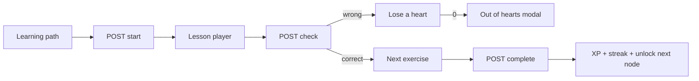

# Duolingo Web Clone

A fullstack Duolingo-style web app: winding learning path, five exercise types, hearts, XP, and streaks. Spanish course is seeded so you can use it immediately.

**Live demo:** https://duolingo-git-main-manish1671s-projects.vercel.app  
**API:** https://duolingo-7ndg.onrender.com  
**GitHub:** https://github.com/Manish1671/Duolingo

Logged in as **Manish** (`X-User-Id: 1`). Unit 1 is already complete.

## Try it

1. Open the live demo. Click **START**, finish a lesson, miss at least one answer.
2. Check XP / streak on the path, then **Settings → Dark mode**.
3. If hearts hit 0, use the heart icon → **Practice to refill**.

The first request after idle time can take ~30s (Render free tier).

## Tech stack

| Layer | Choice |
| --- | --- |
| Frontend | Next.js 16 (App Router) + TypeScript + Tailwind CSS 4 |
| Backend | Python FastAPI |
| Database | SQLite (`backend/duolingo.db`) via SQLAlchemy 2.0 |
| Fonts | Nunito |

## Quick start

### Backend

```bash
cd backend
python -m venv .venv
.venv\Scripts\activate          # Windows
# source .venv/bin/activate     # macOS / Linux
pip install -r requirements.txt
python -m app.seed              # recreates and seeds the database
uvicorn app.main:app --reload --port 8000
```

If Windows blocks port 8000, use `--port 8080` and set `NEXT_PUBLIC_API_URL=http://localhost:8080` in `frontend/.env.local`.

API: http://localhost:8000  
Docs: http://localhost:8000/docs

Empty databases seed on startup. `python -m app.seed` wipes the SQLite file.

### Frontend

```bash
cd frontend
cp .env.example .env.local      # optional; default API is http://localhost:8000
npm install
npm run dev
```

App: http://localhost:3000

## Architecture

```text
browser  →  Next.js (UI, lesson state, path)
                │  REST + X-User-Id: 1
                ▼
            FastAPI
                │
                ▼
         SQLite  (content + progress)
```

- Content tables (courses, units, skills, path nodes, lessons, exercises) are separate from learner tables (stats, progress, attempts).
- Answers are graded on the server. `GET /api/lessons/{id}` does not return `correct_json`.
- Completing a lesson is idempotent (no double XP).
- Hearts regenerate +1 every 4 hours, or refill to 5 after a practice lesson.



## Database schema

```text
users 1──1 user_stats
  │
  ├── user_skill_progress  ── skills
  ├── user_node_progress   ── path_nodes
  ├── lesson_attempts      ── lessons ── exercises
  │         └── attempt_answers
  └── user_achievements    ── achievements

courses ── units ── skills ── path_nodes ── lessons ── exercises
```

Exercise types: `multiple_choice`, `translate_tap`, `match_pairs`, `fill_blank`, `type_answer` (accent-insensitive).

## API overview

| Method | Path | Purpose |
| --- | --- | --- |
| GET | `/api/health` | Liveness |
| GET | `/api/me` | Learner stats. Optional `?simulateDate=YYYY-MM-DD` |
| PATCH | `/api/me/goal` | Daily XP goal |
| GET | `/api/path` | Units + nodes with lock/unlock |
| GET | `/api/lessons/{id}` | Prompts only |
| POST | `/api/lessons/{id}/start` | Create attempt; 403 if locked or 0 hearts |
| POST | `/api/attempts/{id}/check` | Grade one exercise |
| POST | `/api/attempts/{id}/complete` | Award XP, streak, unlock |
| POST | `/api/practice/refill` | Returns a practice lesson id |
| GET | `/api/profile` | Stats + achievements |
| GET | `/api/leaderboard` | Seeded XP board |

Auth is a header: `X-User-Id: 1`.

Streak testing: **Settings → Simulate streak date**, then complete a lesson.

## Tests

```bash
cd backend
python -m unittest discover -s tests -v
```

## Seeded content

- Course: Spanish for English speakers
- 3 units (travel, transportation, food) plus practice nodes
- Default user Manish: 120 XP, 4-day streak, 5 hearts, 250 gems
- 6 rival users on the leaderboard

## Notes

- One language. Hearts max out at 5.
- Shop / Super / friends are UI only.
- SQLite on a free host resets when the instance sleeps unless you attach a disk.

## Deploy

- Backend: Render / Railway, root `backend`, `uvicorn app.main:app --host 0.0.0.0 --port $PORT`
- Frontend: Vercel, root `frontend`, `NEXT_PUBLIC_API_URL` = API origin (no trailing slash)

## Project layout

```text
backend/app/
  main.py              FastAPI app
  models.py            SQLAlchemy schema
  seed.py              Spanish course + demo user
  routers/             me, path, lessons
  services/grading.py  Exercise grader
  services/gamification.py  Hearts, XP, streak
frontend/
  app/                 Next.js routes
  components/          Path, lesson player, exercise UIs
  lib/api.ts           Typed client
```
